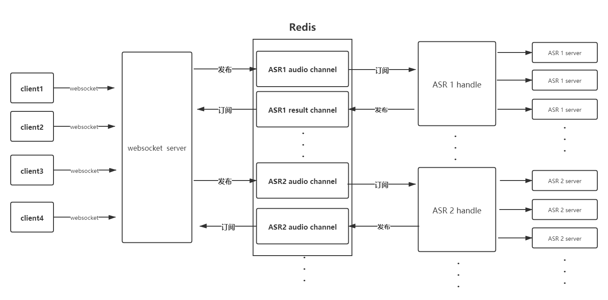

# WebSocket 流式语音识别服务后端

## 1. 介绍

语音识别后端使用python3.7 在sanic下搭建的websocket服务，利用协程模型支持多客户端并发。 

使用 redis 中间件作为存储数据库和消息队列，将识别引擎与语音识别服务解耦。为了以后可扩展更多的语种的识别引擎。甚至可以使用不同编程语言扩展。

语音识别服务功能包括，app key 授权校验，websocket 客户端管理，流量记录（TODO），转写记录（TODO）。

## 2. 部署

```bash
sanic websocket_server.app --host=0.0.0.0 --port=8000
# or
python websocket_server.py
```


 可指定端口部署


### 2.1 服务端配置

#### 2.1.1 静态配置

静态配置文件中包括

```bash
#ASRWebSocketServer/speechServer/config.py 

# --- REDIS ---
REDIS_URL = 'redis://localhost:6379/'
REDIS_HOST = "localhost"
REDIS_PORT = 6379


# --- websocket --
# websocket 超时时间
WEBSOCKETS_TIME_OUT = 30


# --- third party SDK --
app_id = ""
api_key = ""

# -- system --
# 授权链接有效时间，反爬机制，防止抓包链接盗用接口
WEBSOCKETS_SURVIVAL_TIME = 120
```

#### 2.1.2 动态配置

```bash
# 参数列表，必须存储至redis中，指定某一个语言代码发布一个指定频道，由对应的识别引擎处理
languages_code = {
    "zh": {
        "engine": "ifly_audio",
        "language": "简体中文"
    }

}

# --- CHANNEL --
GOOGLE_ASR_RESULT_CHANNEL = "google_result"
GOOGLE_AUDIO_CHANNEL = "google_audio"

# --- CHANNEL --
IFLY_ASR_RESULT_CHANNEL = "ifly_result"
IFLY_AUDIO_CHANNEL = "ifly_audio"


# redis 所有频道列表 必须存储至redis中
ALL_CHANNELS = {
    "google": {
        "result": GOOGLE_ASR_RESULT_CHANNEL,
        "audio": GOOGLE_AUDIO_CHANNEL
    },
    "ifly": {
        "result": IFLY_ASR_RESULT_CHANNEL,
        "audio": IFLY_AUDIO_CHANNEL
    }
}
```


必须将动态参数配置到redis，才可以确保服务可以正常运行



## 3. 客户端

客户端其中包括建立连接，发送数据，接受数据, 下面有两个demo供参考：

Python [Demo](https://github.com/lovemefan/ASRWebSocketServer/blob/master/client/asr_client.py)

Java [Demo](https://github.com/lovemefan/ASRWebSocketServer/tree/master/client/JavaDemo)

具体细节参考下一章

## 4.  服务端

### 4.1 服务端系统架构



### 4.2 服务端的识别引擎扩展

* 从redis订阅中获取数据
* 将数据送入识别应引擎识别
* 将识别结果发布到redis中

python [Demo](https://github.com/lovemefan/ASRWebSocketServer/blob/master/speechServer/asr/xunfei_asr_handle.py)

